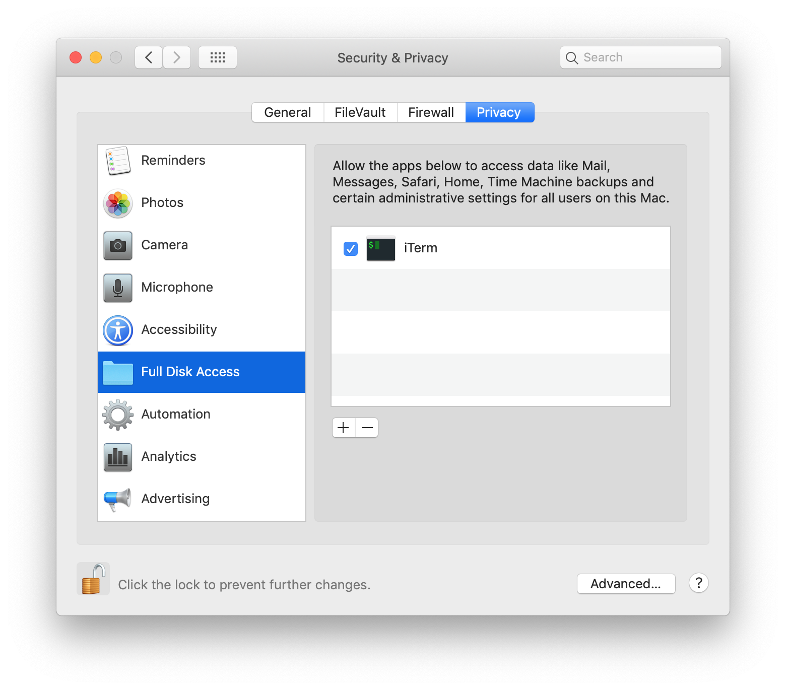

# Safari Bookmarks plist reader

Reads Safari's `Bookmarks.plist`. This includes bookmarks as well as the
reading list.

## What, why, ...?

I wanted to be able to add stuff to the Safari reading list on iOS, then keep
track of it somewhere outside iCloud, by relying on the sync to macOS, then
reading it there.

## Set-up

Recent macOS versions won't let you read from `~/Library/Safari` (a good thing
for security), you'll see this:

    $ cp Library/Safari/Bookmarks.plist /tmp 
    cp: Library/Safari/Bookmarks.plist: Operation not permitted

Fix it by adding the application (i.e. macOS level application, so maybe your
terminal app) to "Full Disk Access" in System Preferences > Security & Privacy, like this:

(Yes, doing this means something running in your terminal can steal your
cookies now. Be careful with your `curl ... | sh` commands again.)

## Development notes

Use `plutil -convert xml1` for a quick way to get a readable file (see also `ply` in go-plist).

No tests, will probably break when Apple change the format of the bookmarks file anyway.
